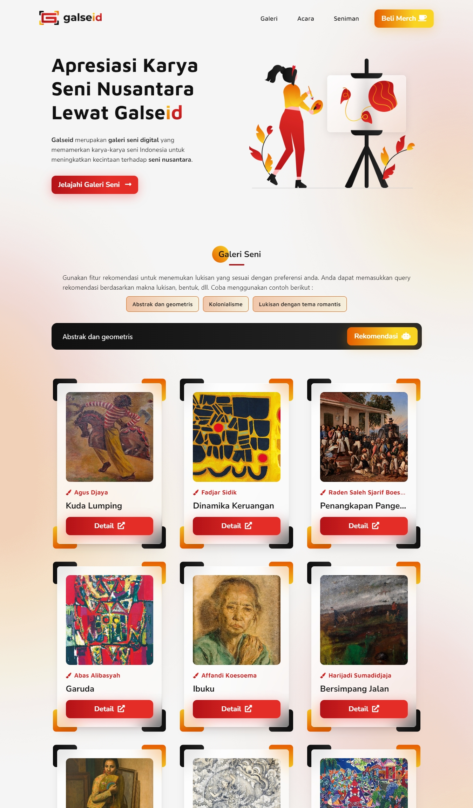

## :information_source: About Galseid

Galseid is a web application that provides a collection of paintings, information on prominent painters, art event agenda, and a stunning merchandise catalog. Through Galseid, we strive to bridge traditional art with modern technology, overcoming the challenge of lack of accessibility and information on Indonesian art and culture.

## :grey_question: Background

Indonesia has various types of arts and culture spread throughout the archipelago, but the lack of accessibility and information about Indonesian cultural arts, plus the impact of globalization that shifts local culture makes people less familiar with and understand Indonesian cultural arts.

Therefore, our team chose this project because we want to promote Indonesian cultural arts to be better known by the public and not to be displaced by globalization while applying the learning paths that we have learned such as Front-End, API (Back-End), and DevOps development to this web application. We also apply Artificial Intelligence (AI) through the painting recommendation feature with the Content-Based Filtering method.

## :man: Our Team
- Muhammad Falah Abdurrafi - [Universitas Stikubank](https://www.unisbank.ac.id/)
- Anthonio Adley Putra Sasangka - [Universitas Gadjah Mada](https://ugm.ac.id/)
- Muhammad Ilham Nor Ramadhani - [Universitas Lambung Mangkurat](https://ulm.ac.id/)
- Ahmad Abdul Basir - [Universitas Bina Sarana Informatika](https://www.bsi.ac.id/)
- Reza Adiyat Dwi Kurniawan - [Universitas Ahmad Dahlan](https://uad.ac.id/)
 

## :orange_book: User Guide
- <a href="https://drive.google.com/file/d/1_OSbWo2afubKuMBLPrsGnyYClXDdrPkX/view" target="_parent">Galseid User Guide</a>
 

## :scroll: Project Brief
- <a href="https://drive.google.com/file/d/1ifA-1OBQwAoJjxz8itXF3QVotwSzsxpo/view" target="_parent">Galseid Project Brief</a>
 

## :globe_with_meridians: API Documentation
- <a href="https://galseid.wip.la/api/v1/records" target="_parent">Galseid API</a>
 

## :computer: Deployed Link
- <a href="https://galseid.wip.la/" target="_parent">www.GALSEID.wip.la</a>
 

## :mag_right: Website Preview

